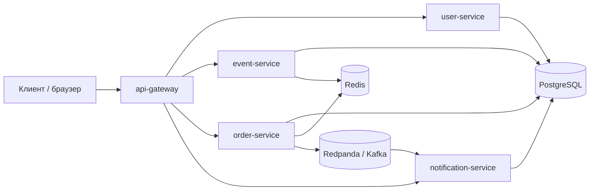

# TicketFlow

TicketFlow - это небольшая платформа бронирования билетов, построенная как набор микросервисов с
PostgreSQL, Redis и Kafka-compatible брокером Redpanda.

## Архитектура



## Сервисы

| Сервис | Порт | Ответственность |
| --- | ---: | --- |
| api-gateway | 8080 | Публичная HTTP-точка входа, reverse proxy и web UI |
| user-service | 8081 | Регистрация, логин, выдача JWT |
| event-service | 8082 | Каталог событий, кэш в Redis, атомарный резерв билетов |
| order-service | 8083 | Создание заказов, idempotency, вызов inventory, публикация Kafka-событий |
| notification-service | 8084 | Kafka consumer и пользовательские уведомления |

## Что Где Лежит

```text
cmd/
  api-gateway/            публичный gateway и встроенный web UI
  user-service/           регистрация и авторизация
  event-service/          события и резервирование билетов
  order-service/          заказы и idempotency
  notification-service/   уведомления из Kafka
  loadgen/                нагрузочный генератор

internal/
  auth/                   JWT и хэширование паролей
  config/                 чтение переменных окружения
  httpx/                  общие HTTP/JSON helpers
  id/                     генерация id
  kafkax/                 Kafka writer и формат событий
  postgres/               подключение к PostgreSQL
  redisx/                 подключение к Redis

migrations/
  001_init.sql            схема базы данных
```

## Запуск

```bash
docker compose up --build
```

После запуска gateway будет доступен по адресу:

```text
http://localhost:8080
```

В браузере откроется простой web-интерфейс. Через него можно:

- зарегистрировать пользователя или войти;
- создать событие;
- выбрать событие и купить билет;
- посмотреть уведомления;
- видеть ответы API в лог-панели.

## Основной Сценарий

### 1. Создать событие

```bash
curl -s -X POST http://localhost:8080/events \
  -H 'Content-Type: application/json' \
  -d '{"title":"Go Junior Conf","starts_at":"2026-09-01T19:00:00Z","price_cents":2500,"capacity":20}'
```

### 2. Зарегистрировать пользователя

```bash
curl -s -X POST http://localhost:8080/users/register \
  -H 'Content-Type: application/json' \
  -d '{"email":"dev@example.com","password":"secret123","name":"Dev"}'
```

Ответ содержит `user_id` и `token`. Токен нужно передавать в защищенные ручки:

```http
Authorization: Bearer <token>
```

### 3. Создать заказ

```bash
curl -s -X POST http://localhost:8080/orders \
  -H 'Content-Type: application/json' \
  -H "Authorization: Bearer $TOKEN" \
  -d '{"event_id":"'$EVENT_ID'","quantity":1,"idempotency_key":"first-order"}'
```

### 4. Прочитать уведомления

```bash
curl -s http://localhost:8080/notifications \
  -H "Authorization: Bearer $TOKEN"
```

## Как Проходит Покупка Билета

1. Клиент отправляет `POST /orders` в `api-gateway`.
2. Gateway проксирует запрос в `order-service`.
3. `order-service` проверяет JWT.
4. `order-service` пытается записать idempotency key в Redis через `SETNX`.
5. Если такой ключ уже есть, сервис возвращает старый результат или сообщает, что заказ еще обрабатывается.
6. Если ключ новый, создается заказ в статусе `pending`.
7. `order-service` вызывает `event-service`: `POST /events/{event_id}/reserve`.
8. `event-service` атомарно уменьшает `available` в PostgreSQL.
9. Если билеты есть, заказ становится `confirmed`.
10. `order-service` публикует событие `order.created` в Kafka topic `orders`.
11. `notification-service` читает событие из Kafka и сохраняет уведомление.

## Нагрузочная Проверка

После создания события можно проверить конкурентную покупку:

```bash
go run ./cmd/loadgen -url http://localhost:8080 -event "$EVENT_ID" -users 30 -orders 120 -qty 1
```

Если у события `capacity = 20`, то подтвердиться должны только 20 заказов.
Остальные будут отклонены из-за нехватки билетов.

## Полезные Команды

```bash
make up      # docker compose up --build
make down    # docker compose down
make logs    # логи docker compose
make fmt     # gofmt для cmd и internal
make test    # go test ./...
make load    # запуск loadgen, нужен EVENT_ID
```

Пример запуска loadgen через Makefile:

```bash
make load EVENT_ID=evt_...
```
