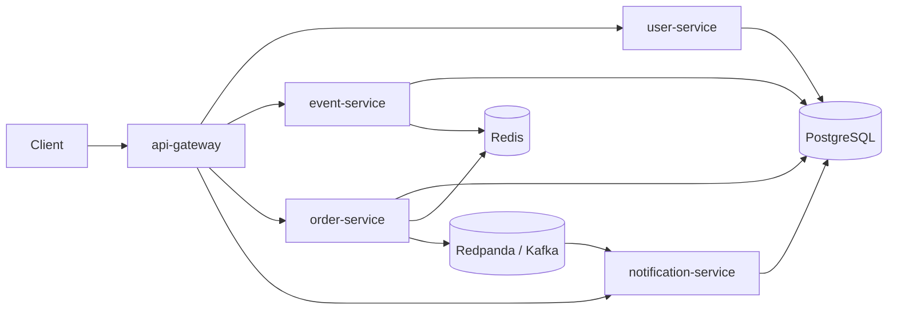

# TicketFlow

TicketFlow is a Go pet project for a junior backend interview. It is a small ticket booking platform built as microservices with PostgreSQL, Redis and Kafka-compatible Redpanda.

The project is intentionally focused on things interviewers like to discuss:

- many users create orders at the same time;
- ticket stock is reserved atomically;
- duplicate client retries are handled with an idempotency key;
- Redis is used for caching and idempotency state;
- Kafka events decouple order processing from notifications;
- services are split by ownership boundaries.

## Architecture



## Services

| Service | Port | Responsibility |
| --- | ---: | --- |
| api-gateway | 8080 | Public HTTP entrypoint and reverse proxy |
| user-service | 8081 | Registration, login, token issuing |
| event-service | 8082 | Event catalog, Redis cache, atomic ticket reservation |
| order-service | 8083 | Order creation, idempotency, inventory call, Kafka publish |
| notification-service | 8084 | Kafka consumer and user notifications |

## Run

```bash
docker compose up --build
```

The gateway will be available at `http://localhost:8080`.

Open `http://localhost:8080` in a browser to use the simple web interface. It can register or log in a user, create events, buy tickets and read notifications.

## Try the flow

Create an event:

```bash
curl -s -X POST http://localhost:8080/events \
  -H 'Content-Type: application/json' \
  -d '{"title":"Go Junior Conf","starts_at":"2026-09-01T19:00:00Z","price_cents":2500,"capacity":20}'
```

Register a user:

```bash
curl -s -X POST http://localhost:8080/users/register \
  -H 'Content-Type: application/json' \
  -d '{"email":"dev@example.com","password":"secret123","name":"Dev"}'
```

Save the returned token and event id, then create an order:

```bash
curl -s -X POST http://localhost:8080/orders \
  -H 'Content-Type: application/json' \
  -H "Authorization: Bearer $TOKEN" \
  -d '{"event_id":"'$EVENT_ID'","quantity":1,"idempotency_key":"first-order"}'
```

Read notifications:

```bash
curl -s http://localhost:8080/notifications \
  -H "Authorization: Bearer $TOKEN"
```

## Load test the concurrent path

After creating an event, run:

```bash
go run ./cmd/loadgen -url http://localhost:8080 -event "$EVENT_ID" -users 30 -orders 120 -qty 1
```

If event capacity is 20, only 20 orders should be confirmed. The rest should be rejected because `event-service` performs this atomic update:

```sql
update events
set available = available - $1
where id = $2 and available >= $1
returning available;
```

That one statement is the main protection against overselling under concurrent load.

## Interview talking points

- Why inventory belongs to `event-service`, not `order-service`.
- Why Redis idempotency uses `SETNX` before creating an order.
- Why the current Kafka publish can still be lost after a DB commit, and how the transactional outbox pattern would fix it.
- How to scale services horizontally: multiple `order-service` replicas are safe because stock is protected in PostgreSQL.
- Why `notification-service` can be eventually consistent.
- What should change for production: stronger password hashing, refresh tokens, observability, retries with backoff, dead-letter topics, migrations via a dedicated tool, tracing and outbox.

## Useful commands

```bash
make fmt
make test
make up
make logs
make down
```
